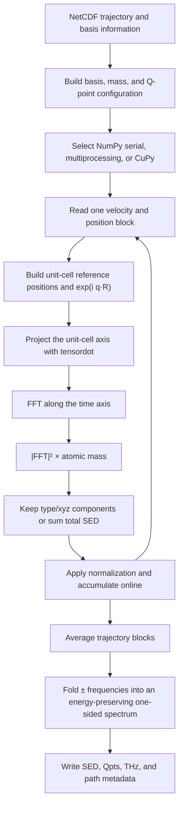

# MDtrace - Molecular Dynamic Trajectory Trace

> **Trace the physics inside your MD trajectory.**

MDtrace extracts reciprocal-space observables from molecular-dynamics
trajectories. The current production workflow calculates phonon spectral energy
density (SED), plots kinetic-energy-weighted phonon dispersions, decomposes SED
by element and Cartesian direction, and fits spectral peaks. A dynamic structure
factor (DSF) workflow is being developed on the same trajectory and command
infrastructure.

## Contents

- [Installation](#installation)
- [Quick start](#quick-start)
- [Common commands and workflow](#common-commands-and-workflow)
- [Common input parameters](#common-input-parameters)
- [SED workflow](#sed-workflow)
- [SED input parameters](#sed-input-parameters)
- [SED theory and normalization](#sed-theory-and-normalization)
- [Output files](#output-files)
- [Troubleshooting](#troubleshooting)
- [References](#references)

## Installation

### From source

```bash
git clone https://github.com/Tingliangstu/mdtrace.git
cd mdtrace
python -m pip install .
mdtrace -h
```

The trajectory and SED dependencies, including NumPy, SciPy, netCDF4, and
Matplotlib, are installed automatically.

### Optional CuPy backend

Install the CuPy wheel matching the CUDA Toolkit:

```bash
# Choose one
python -m pip install cupy-cuda12x
python -m pip install cupy-cuda13x
```

or:

```bash
conda install -c conda-forge cupy
```

Then set `backend = cupy`. The current CuPy implementation uses one GPU per
MDtrace process.

## Quick start

Create `input.in`:

```ini
# ==================== Common control ====================
action  = thinking
method  = sed
backend = numpy

# ==================== Trajectory ====================
trajectory_file    = ../gpumd_run/movie.nc
out_files_name     = CNT
time_step          = 1.0
output_data_stride = 10
num_blocks         = 5
max_cores          = 8

# ==================== SED structure ====================
num_atoms          = 17920
total_num_steps    = 500000
basis_lattice_file = ../structure/basis.in
supercell_dim      = 1 1 160
prim_unitcell      = 237.433 0 0  0 237.433 0  0 0 2.463
rescale_prim       = 1

# ==================== SED Q path ====================
num_qpaths  = 1
q_path_name = GA
q_path      = 0 0 0  0 0 1/2

# ==================== SED plot ====================
plot_cutoff_freq  = 50
plot_interval     = 10
plot_slice        = 1
qpoint_slice_index = 0
if_show_figures   = 0

# ==================== Optional peak fitting ====================
lorentz                = 0
lorentz_fit_all_qpoint = 0
```

Run:

```bash
mdtrace input.in
```

`thinking` mode prepares the trajectory when necessary, computes missing SED
data, and creates the requested plots. Lorentzian fitting is included only when
`lorentz = 1`.

## Common commands and workflow

These commands are shared by SED and future calculation methods:

```bash
mdtrace                 # input.in, or legacy input_SED.in
mdtrace my_case.in      # explicit input file
mdtrace -h              # command summary
```

The input file controls the task:

| Setting | Meaning |
|---|---|
| `action = thinking` | Inspect existing outputs and run the missing stages |
| `action = compute` | Run the compute stage if its main output is absent |
| `action = plot` | Plot existing numerical output |
| `action = fit` | Fit existing SED output |
| `method = sed` | Phonon spectral energy density |
| `method = dsf` | Dynamic structure factor; calculation support is preliminary |
| `method = eels` | Reserved; not implemented |

MDtrace does not overwrite an existing main calculation file in `thinking` or
`compute` mode. Rename or remove the old output before intentionally
recomputing it.

### Trajectory handling

`trajectory_file` can point to:

- a GPUMD extended-XYZ trajectory containing positions and velocities;
- one LAMMPS custom dump containing `id`, positions, and velocities;
- a compatible GPUMD, LAMMPS, or MDtrace NetCDF file.

Text formats are detected automatically, streamed once into
`<trajectory_file>.mdtrace.nc`, and reused while the source and conversion
settings remain unchanged. NetCDF input is read directly and block by block.

A suitable LAMMPS dump is:

```lammps
dump mdtrace all custom ${dump_stride} trajectory.dump \
     id type x y z vx vy vz
dump_modify mdtrace sort id
```

Set `lammps_unit = metal` for velocities in Angstrom/ps or `real` for
Angstrom/fs.

## Common input parameters

Common parameters belong here rather than inside an SED- or DSF-specific
section.

| Parameter | Default | Description |
|---|---:|---|
| `action` | `thinking` | `thinking`, `compute`, `plot`, or `fit` |
| `method` | `sed` | Calculation method |
| `backend` | `numpy` | `numpy` or optional `cupy` |
| `trajectory_file` | `dump.xyz` | Input trajectory |
| `out_files_name` | `mdtrace` | Output prefix |
| `lammps_unit` | `metal` | LAMMPS text velocity convention |
| `time_step` | required for compute | MD integration step in fs |
| `output_data_stride` | required for compute | MD steps between saved frames |
| `num_blocks` | `5` | Independent trajectory blocks used for averaging |
| `max_cores` | `4` | Maximum NumPy worker processes; `1` is serial |
| `prim_unitcell` | required for compute | Nine row-major primitive-cell values in Angstrom |
| `netcdf_compression_level` | `1` | Compression for converted text trajectories; use `0` for temporary high-speed conversion |
| `netcdf_batch_size` | `32` | Frames parsed and written per conversion batch |

The saved-frame interval is

\[
\Delta t=\texttt{time\_step}\times\texttt{output\_data\_stride}.
\]

The number of requested frames is

\[
N_{\mathrm{frames}}
=
\frac{\texttt{total\_num\_steps}}
{\texttt{output\_data\_stride}},
\]

and must be divisible by `num_blocks`. A trajectory may contain more frames
than requested; MDtrace reads only the requested range.

## SED workflow

### 1. Prepare a production trajectory

The trajectory must contain positions, velocities, and cell information. A
well-equilibrated NVT structure followed by an NVE or weakly perturbed
production trajectory is usually preferable for linewidth analysis.

### 2. Prepare `basis.in`

Every trajectory atom must be mapped to a repeated unit cell and a basis atom:

```text
# MDtrace basis mapping
atoms_ids unitcell_index basis_index mass_types
1  1  1  12.011000
2  1  2  12.011000
3  2  1  12.011000
4  2  2  12.011000
```

Atom IDs, atom order, masses, and the maximum atom ID must agree with the
trajectory. Each basis index must occur exactly once per unit cell.

### 3. Choose commensurate Q paths

`q_path` uses reduced coordinates of the primitive reciprocal lattice and
accepts decimals or fractions such as `1/2` and `1/3`. MDtrace retains only
points that satisfy the supercell commensurability condition. Increasing the
supercell along the target direction produces a denser exact Q grid.

### 4. Compute, inspect, then fit

Start with `lorentz = 0`. Check the dispersion and several individual
Q-point slices first. Enable fitting only after choosing sensible peak height,
prominence, frequency cutoff, and initial HWHM for the system.

### 5. Select the compute backend

- `backend = numpy`, `max_cores = 1`: serial NumPy.
- `backend = numpy`, `max_cores > 1`: persistent CPU processes with one shared
  velocity block.
- `backend = cupy`: single-GPU computation; `max_cores` is not used by the SED
  kernel.

For typical paths with 20-40 Q points, MDtrace sends small Q-point batches to
workers. Increasing `max_cores` beyond the available batches does not provide
additional speed.

## SED input parameters

### Structure and sampling

| Parameter | Default | Description |
|---|---:|---|
| `num_atoms` | required | Number of trajectory atoms |
| `total_num_steps` | required | Production MD steps represented by the requested trajectory range |
| `basis_lattice_file` | `basis.in` | Atom-to-cell and atom-to-basis mapping |
| `supercell_dim` | `1 1 1` | Primitive-cell repetitions |
| `prim_axis` | `None` | Optional nine-value primitive-axis transformation |
| `rescale_prim` | `1` | Reconstruct the primitive cell from the trajectory cell when required |

### Q paths

| Parameter | Default | Description |
|---|---:|---|
| `num_qpaths` | `1` | Number of connected path segments |
| `q_path_name` | `GA` | One label per path vertex; `G` is plotted as Γ |
| `q_path` | required | `num_qpaths + 1` reduced-coordinate triples |

For two segments, for example Γ-X-M:

```ini
num_qpaths  = 2
q_path_name = GXM
q_path      = 0 0 0  1/2 0 0  1/2 1/2 0
```

### Plotting and partial SED

| Parameter | Default | Description |
|---|---:|---|
| `plot_cutoff_freq` | `None` | Maximum plotted frequency in THz |
| `plot_interval` | `5.0` | Frequency tick interval in THz |
| `plot_color` | `RdBu_r` | Matplotlib colormap |
| `colorbar_min`, `colorbar_max` | `None` | Optional fixed color limits |
| `use_contourf` | `0` | Use filled contours instead of the default image path |
| `plot_slice` | `0` | Plot one Q-point spectrum |
| `qpoint_slice_index` | `0` | Zero-based Q-point index |
| `if_show_figures` | `0` | Show figures interactively |
| `output_partial` | `0` | Save element/type and x/y/z contributions during compute |
| `plot_partial_SED` | disabled | Element and optional direction, for example `C` or `C z` |

Partial output must be enabled during the original calculation:

```ini
output_partial = 1
```

It can then be selected during plotting:

```ini
plot_partial_SED = C
# or
plot_partial_SED = C z
```

### Lorentzian fitting

| Parameter | Default | Description |
|---|---:|---|
| `lorentz` | `0` | Enable fitting |
| `lorentz_fit_all_qpoint` | `0` | Fit every Q-point rather than one slice |
| `lorentz_fit_cutoff` | `None` | Highest fitted frequency in THz |
| `peak_height` | `None` | Minimum peak height |
| `peak_prominence` | `None` | Minimum peak prominence |
| `initial_guess_hwhm` | `0.001` | Initial HWHM in THz |
| `peak_max_hwhm` | `1e6` | Upper HWHM bound in THz |
| `modulate_factor` | `0` | Shrink the detected fitting interval by this many samples per side |
| `re_output_total_freq_lifetime` | `0` | Rebuild the combined lifetime file |

The fitted Lorentzian is

\[
L(f)=\frac{I}{1+\left[(f-f_c)/h\right]^2},
\]

where \(h\) is the fitted HWHM in THz and \(\mathrm{FWHM}=2h\).
The current lifetime output retains MDtrace's existing HWHM conversion
convention. Readers requiring an energy-relaxation lifetime should explicitly
check the linewidth convention used in their target theory or experiment before
quantitative interpretation.

## SED theory and normalization

### Eigenvector-free SED

MDtrace implements the eigenvector-free expression:

\[
\Phi'(\mathbf q,\omega)=
\frac{1}{4\pi\tau_0N_T}
\sum_{\alpha=1}^{3}\sum_{b=1}^{n}m_b
\left|
\int_0^{\tau_0}
\sum_{l=1}^{N_T}
\dot u_\alpha(l,b,t)
\exp\!\left[i\mathbf q\cdot\mathbf r_0(l)-i\omega t\right]dt
\right|^2 .
\]

Here \(n\) is the number of basis atoms, \(N_T\) is the number of repeated
unit cells, \(m_b\) is the basis-atom mass, and \(\mathbf r_0(l)\) is the
equilibrium reference position of unit cell \(l\).

### Why the discrete FFT contains \(\Delta t^2\)

NumPy and CuPy FFTs return a discrete sum, not a time integral:

\[
\int_0^{\tau_0}v(t)e^{-i\omega t}dt
\approx
\Delta t\sum_{j=0}^{N-1}v_j e^{-i\omega t_j}.
\]

The SED contains the squared magnitude of this integral, so the numerical
normalization must contain \(\Delta t^2\):

\[
\Phi'_{\mathrm{discrete}}
=
\frac{\Delta t^2}{4\pi\tau_0N_T}
\sum_{\alpha,b}m_b
\left|\mathrm{FFT}\left[
\sum_l\dot u_\alpha(l,b,t)
e^{i\mathbf q\cdot\mathbf r_0(l)}
\right]\right|^2.
\]

This is also the convention used in dynasor's SED implementation.

### Units

MDtrace normalizes velocities to \(\mathrm{m\,s^{-1}}\), time to seconds,
and mass to kilograms:

\[
\Delta t\sum v:
\qquad
\mathrm{s}\times\frac{\mathrm m}{\mathrm s}
=\mathrm m.
\]

Therefore:

\[
\frac{m_b\left|\Delta t\sum v\right|^2}{\tau_0}
=
\frac{\mathrm{kg\,m^2}}{\mathrm s}
=
\mathrm{J\,s}.
\]

The first \(m_b\) is atomic mass; the \(\mathrm{m^2}\) in the unit is metre
squared and comes from the squared time-integrated velocity.

### Energy-preserving one-sided spectrum

MDtrace folds the two-sided FFT onto positive frequencies:

\[
\Phi_+(\omega_k)=
\begin{cases}
\Phi(0), & k=0,\\
\Phi(+\omega_k)+\Phi(-\omega_k), & k>0.
\end{cases}
\]

This preserves the two-sided spectral power while avoiding redundant negative
frequencies. For a classical crystal at equilibrium and a commensurate Q point,
the expected sum rule is approximately

\[
\int_0^\infty \Phi_+(\mathbf q,\omega)d\omega
=
\frac12N_{\mathrm{bands}}k_BT,
\qquad
N_{\mathrm{bands}}=3n.
\]

MDtrace writes ordinary frequency \(f\) in THz but stores
\(\Phi_\omega\) in \(\mathrm{J\,s}\). Since
\(d\omega=2\pi\times10^{12}\,df_{\mathrm{THz}}\), the following diagnostic
returns an effective SED temperature:

```python
import numpy as np

k_B = 1.380649e-23  # J/K
prefix = "CNT"
q_index = 1
n_basis = 2

frequency_thz = np.loadtxt(prefix + ".THz")
sed = np.loadtxt(prefix + ".SED")[:, q_index]

energy_joule = (
    2 * np.pi * 1.0e12
    * np.trapz(sed, frequency_thz)
)
temperature_sed = energy_joule / (
    0.5 * (3 * n_basis) * k_B
)
print(f"SED temperature: {temperature_sed:.2f} K")
```

Finite trajectory length, statistical noise, constraints, removed center-of-mass
motion, and the Γ-point translational modes cause deviations. At Γ, three
zero-frequency translational modes may be absent, giving approximately
\(\frac12(3n-3)k_BT\).

### How `Phonon.py` evaluates SED



The main implementation choices are:

1. `basis_ids`, masses, type mappings, and Q points are prepared once.
2. Only one NetCDF trajectory block is loaded at a time.
3. CPU workers reuse one process pool and access the block through shared
   memory; the full velocity array is not copied into every Q-point task.
4. `tensordot` contracts the unit-cell axis while retaining time, Q point, and
   Cartesian direction.
5. NumPy and CuPy use the same mathematical kernel.
6. Each normalized block is accumulated immediately, so all block spectra are
   not stored simultaneously.
7. CuPy checks estimated free device memory before the first block and releases
   its memory pools after SED calculation.

## Output files

For `out_files_name = CNT`:

| Output | Contents |
|---|---|
| `CNT.SED` | Rows: positive-frequency samples; columns: Q points |
| `CNT.THz` | Ordinary frequency in THz |
| `CNT.Qpts` | Reduced commensurate Q points |
| `CNT.Q_distances_and_labels` | Path coordinates and high-symmetry labels |
| `CNT-SED.png` | Dispersion plot |
| `SED-<index>-qpoint.png` | Single-Q spectrum |
| `CNT_partial_SED/` | Optional element/type and x/y/z spectra |
| `CNT_LORENTZ-<index>.params` | Fitted center, amplitude, and HWHM |
| `CNT_LORENTZ-<index>.error` | Standard errors from the fit covariance |
| `LORENTZ-<index>-th-Qpoints.Fre_lifetime` | Per-Q fitted frequencies and current lifetime output |
| `TOTAL-LORENTZ-Qpoints.Fre_lifetime` | Combined all-Q fit output |

## Troubleshooting

### No Q points appear on a requested path

The path does not intersect the exact reciprocal grid of the finite supercell.
Increase the supercell along the target direction or choose a symmetry-equivalent
path with denser commensurate sampling. Arbitrary incommensurate points can
produce aliasing and should not be used for quantitative SED.

### Frequencies are truncated or aliased

The saved-frame interval determines the Nyquist frequency:

\[
f_{\mathrm{Nyquist}}
=
\frac{1}{2\Delta t}.
\]

Reduce `output_data_stride` when the required phonon frequencies approach this
limit.

### Peaks are too broad to fit

One block has duration

\[
\tau_0=
\frac{\texttt{total\_num\_steps}\times\texttt{time\_step}}
{\texttt{num\_blocks}},
\]

so its approximate frequency spacing is \(1/\tau_0\). Fewer, longer blocks
improve frequency resolution; more blocks improve averaging statistics.

### CuPy reports insufficient memory

Increase `num_blocks` so each uploaded velocity block is smaller, or use
`backend = numpy`.

### A text trajectory is converted again

MDtrace rebuilds the neighboring `.mdtrace.nc` file when the source or relevant
conversion settings change. Keep both files unchanged to reuse the conversion.

## References

If MDtrace is used for SED analysis, please cite:

1. T. Liang *et al.*, "PYSED: A tool for extracting kinetic-energy-weighted
   phonon dispersion and lifetime from molecular dynamics simulations,"
   *Journal of Applied Physics* **138**, 075101 (2025).
   [DOI: 10.1063/5.0278798](https://doi.org/10.1063/5.0278798)
2. J. A. Thomas *et al.*, "Predicting phonon dispersion relations and
   lifetimes from the spectral energy density," *Physical Review B* **81**,
   081411 (2010).
   [DOI: 10.1103/PhysRevB.81.081411](https://doi.org/10.1103/PhysRevB.81.081411)

Useful implementation and normalization comparison:

- [dynasor SED tutorial](https://dynasor.materialsmodeling.org/dev/tutorials/sed.html)
- [PYSED article](https://pubs.aip.org/aip/jap/article/138/7/075101/3359033/PYSED-A-tool-for-extracting-kinetic-energy)
