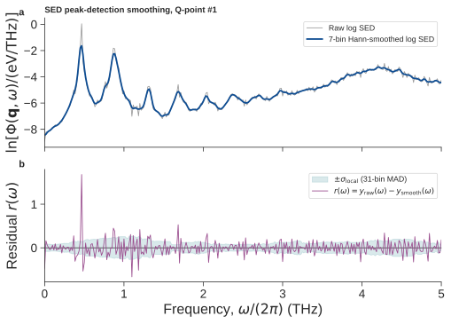

Input parameters
================

MDtrace reads a plain-text input file. Each active line has the form

.. code-block:: text

   parameter_name = value

Blank lines and text following ``#`` are ignored. Version 1.0 supports the SED
workflow; DSF and EELS are planned future extensions.

Common parameters
-----------------

.. list-table::
   :header-rows: 1
   :widths: 23 18 59

   * - Parameter
     - Default
     - Meaning
   * - ``action``
     - ``thinking``
     - ``thinking`` reuses completed stages; ``compute`` always recalculates;
       ``plot`` and ``fit`` use existing output
   * - ``method``
     - ``sed``
     - ``sed`` is the supported 1.0 method
   * - ``backend``
     - ``numpy``
     - ``numpy`` or optional ``cupy``
   * - ``trajectory_file``
     - ``dump.xyz``
     - GPUMD XYZ, one LAMMPS dump, or compatible NetCDF
   * - ``out_files_name``
     - ``mdtrace``
     - Output prefix
   * - ``lammps_unit``
     - ``metal``
     - ``metal`` for Angstrom/ps; ``real`` for Angstrom/fs
   * - ``time_step``
     - ``0.0``
     - MD integration step in fs; positive value required for compute
   * - ``output_data_stride``
     - ``0``
     - MD steps between saved frames; positive value required for compute
   * - ``num_blocks``
     - ``5``
     - Trajectory blocks used for spectral averaging
   * - ``max_cores``
     - ``4``
     - Maximum NumPy worker processes; ``1`` is serial
   * - ``prim_unitcell``
     - ``None``
     - Nine row-major primitive-cell values in Angstrom
   * - ``netcdf_compression_level``
     - ``1``
     - zlib compression level for converted text trajectories; ``0`` disables
       compression
   * - ``netcdf_batch_size``
     - ``64``
     - Frames parsed and written per conversion batch

SED structure and sampling
--------------------------

.. list-table::
   :header-rows: 1
   :widths: 23 18 59

   * - Parameter
     - Default
     - Meaning
   * - ``num_atoms``
     - ``0``
     - Number of atoms; positive value required for compute
   * - ``total_num_steps``
     - ``0``
     - Production steps represented by the requested trajectory range
   * - ``basis_lattice_file``
     - ``basis.in``
     - Atom-to-cell, atom-to-basis, and mass mapping
   * - ``supercell_dim``
     - ``1 1 1``
     - Primitive-cell repetitions
   * - ``prim_axis``
     - ``None``
     - Optional nine-value primitive-axis transformation
   * - ``rescale_prim``
     - ``1``
     - Reconstruct the primitive cell from a relaxed trajectory cell

The saved-frame interval is

.. math::

   \Delta t
   =
   \mathtt{time\_step}\,
   \mathtt{output\_data\_stride}.

The requested number of frames is

.. math::

   N_\mathrm{frames}
   =
   \frac{\mathtt{total\_num\_steps}}
   {\mathtt{output\_data\_stride}},

and must be divisible by ``num_blocks``. The input trajectory may contain more
frames; MDtrace reads only the requested range.

SED Q paths
-----------

.. list-table::
   :header-rows: 1
   :widths: 23 18 59

   * - Parameter
     - Default
     - Meaning
   * - ``num_qpaths``
     - ``1``
     - Number of connected path segments
   * - ``q_path_name``
     - ``GA``
     - One label per vertex; ``G`` is displayed as Gamma
   * - ``q_path``
     - ``None``
     - ``num_qpaths + 1`` reduced-coordinate triples

Decimals and fractions are accepted:

.. code-block:: text

   num_qpaths  = 2
   q_path_name = GXM
   q_path      = 0 0 0  1/2 0 0  1/2 1/2 0

Only points commensurate with the finite supercell are retained.

SED plotting and decomposition
------------------------------

.. list-table::
   :header-rows: 1
   :widths: 23 18 59

   * - Parameter
     - Default
     - Meaning
   * - ``plot_cutoff_freq``
     - ``None``
     - Maximum plotted frequency in THz
   * - ``plot_interval``
     - ``5.0``
     - Frequency tick interval in THz
   * - ``plot_color``
     - ``RdBu_r``
     - Matplotlib colormap
   * - ``colorbar_min``, ``colorbar_max``
     - ``None``
     - Optional dimensionless limits for
       ``ln[SED / (1 eV THz^-1)]``
   * - ``use_contourf``
     - ``0``
     - Use filled contours
   * - ``plot_slice``
     - ``0``
     - Plot a single-Q SED in ``eV/THz`` on a logarithmic y-axis
   * - ``qpoint_slice_index``
     - ``0``
     - Zero-based Q-point index
   * - ``if_show_figures``
     - ``0``
     - Show figures interactively
   * - ``output_partial``
     - ``0``
     - Save element and x/y/z components during compute
   * - ``plot_partial_SED``
     - disabled
     - Element plus optional direction, e.g. ``C`` or ``C z``

Partial SED must be enabled during compute:

.. code-block:: text

   output_partial = 1

It can later be selected during plotting:

.. code-block:: text

   plot_partial_SED = C
   # or
   plot_partial_SED = C z

SED spectral-peak fitting
-------------------------

.. list-table::
   :header-rows: 1
   :widths: 27 18 55

   * - Parameter
     - Default
     - Meaning
   * - ``lorentz_fit_all_qpoint``
     - ``0``
     - ``1`` fits every Q point; ``0`` fits only ``qpoint_slice_index``
   * - ``lorentz_fit_freq_min``
     - ``None``
     - Lowest fitted frequency in THz
   * - ``lorentz_fit_freq_max``
     - ``None``
     - Highest fitted frequency in THz
   * - ``fitting_function``
     - ``auto``
     - Line shape: ``lorentz``, ``dho``, or ``auto``
   * - :doc:`peak_min_significance <peak_detection>`
     - ``4.0``
     - Minimum dimensionless local-noise significance for peak detection
   * - ``initial_guess_hwhm``
     - ``0.001``
     - Initial HWHM in THz; it affects optimizer convergence, not frequency
       resolution
   * - ``peak_max_hwhm``
     - ``1e6``
     - Upper HWHM bound in THz
   * - ``modulate_factor``
     - ``0``
     - Samples removed from each side of the detected fit interval
   * - ``re_output_total_freq_lifetime``
     - ``0``
     - After a single-Q refit, rebuild the combined lifetime file and figure;
       ignored during all-Q fitting

Fit a few single-Q spectra before enabling all-Q fitting. In strongly
anharmonic systems, treat the reported time as a qualitative spectral
descriptor rather than a quantitatively exact phonon or transport lifetime.

The frequency spacing of each fitted, block-averaged spectrum is approximately

.. math::

   \Delta f\,[\mathrm{THz}]
   =
   \frac{1000\,\mathtt{num\_blocks}}
        {\mathtt{total\_num\_steps}\,
         \mathtt{time\_step}\,[\mathrm{fs}]}.

For ``total_num_steps = 300000``, ``time_step = 1`` fs, and
``num_blocks = 5``, this gives :math:`\Delta f\approx0.0167` THz.
``initial_guess_hwhm = 0.01`` is therefore a reasonable starting value for
that example, but it does not improve the underlying frequency resolution.
See :doc:`input_parameters/initial_guess_hwhm` for details.

Independent zero-background peak fitting
~~~~~~~~~~~~~~~~~~~~~~~~~~~~~~~~~~~~~~~~

MDtrace fits every detected peak separately. Each local fitting basin is
bounded by the lowest points of the seven-sample detection-smoothed log
spectrum between neighboring detected peaks. For the first or last peak, the
outer boundary is the lowest smoothed point between that peak and the selected
frequency-range edge. This prevents one noisy raw sample from truncating a
broad peak. After
``modulate_factor`` is applied, every original, unsmoothed linear-SED sample in
the resulting local range is fitted. Peaks are not grouped, jointly fitted, or
deconvolved, and the background is fixed to zero.

For a Lorentz fit, the local model is

.. math::

   \Phi(f)
   =
   \frac{A}
        {1+[(f-f_c)/h]^2}.

The fit figure draws each green fitted curve only over the local range actually
used in the optimization. It does not extrapolate or sum independently fitted
peaks.

``fitting_function = dho`` uses the velocity-spectrum damped harmonic
oscillator line shape

.. math::

   D(f)=
   A\frac{(2h)^2 f^2}
   {(f^2-f_0^2)^2+(2hf)^2}.

The reported :math:`h` is half the DHO FWHM, so its weak-damping
linewidth-derived lifetime conversion is the same ``1/(2*pi*h)`` convention
used for the Lorentz HWHM.
In ``auto`` mode MDtrace fits Lorentz and DHO on the *same local peak range*,
compares AICc, and chooses Lorentz when candidates are within two
AICc units. It also chooses Lorentz when the fitted DHO damping ratio
``h/f0`` is below 0.05, where the two shapes are practically
indistinguishable. The selected line shape is reported in the terminal output.

For an underdamped DHO, the reported ``tau_SED`` remains a linewidth-derived
spectral/coherence time. For critical or overdamped DHO fits, it is not a
strict phonon lifetime. MDtrace retains the value in the lifetime data for
qualitative comparison only. Compare broad or overdamped peaks only when the
sampling length, frequency resolution, Q grid, and fitting settings are held
fixed.

Select a finite fitting interval with both bounds:

.. code-block:: text

   lorentz_fit_freq_min = 2.0
   lorentz_fit_freq_max = 5.0

Both endpoints are included. The default for both parameters is ``None``. If
neither parameter is written, MDtrace detects and fits peaks over the complete
available frequency interval. The fitted single-Q figure uses the same
displayed frequency range.

Local-noise peak detection
~~~~~~~~~~~~~~~~~~~~~~~~~~

For a visual, step-by-step explanation and tuning guide, see
:doc:`peak_detection`.

Peak detection is controlled by the single dimensionless parameter

.. code-block:: text

   peak_min_significance = 4.0

whose default is ``4.0``.

The complete detection and fitting flow is:

.. code-block:: text

   original linear SED
       |
       v
   take the natural logarithm
       |
       v
   apply a 7-point Hann window to a detection-only copy
       |
       v
   residual = original log SED - smoothed log SED
       |
       v
   estimate local noise with a 31-point rolling MAD
       |
       v
   significance = smoothed-log prominence / local noise
       |
       v
   retain candidates with significance >= peak_min_significance
       |
       v
   refine each candidate to a nearby maximum of the original SED
       |
       v
   fit the original, unsmoothed, linear SED

   Detection-only smoothing and local-noise estimation for Q-point #1 of the
   SrTiO3 example over 0--5 THz. Panel **a** compares the raw log SED with its
   seven-point Hann-smoothed copy. Panel **b** shows the residual
   :math:`r(\omega)` and the local noise band obtained from the 31-point
   rolling MAD. The horizontal coordinate is written as
   :math:`\omega/(2\pi)` because the FFT frequency array is reported in THz.

MDtrace first takes the natural logarithm of the positive SED values and
creates a seven-point Hann-smoothed copy for **peak detection only**. It
estimates the local noise from the difference between the unsmoothed and
smoothed log spectra:

.. math::

   y_\mathrm{raw}(\omega)
   =
   \ln\left[
   \frac{\Phi(\mathbf{q},\omega)}
        {1\,\mathrm{eV\,THz^{-1}}}
   \right],

.. math::

   r(\omega)
   =
   y_\mathrm{raw}(\omega)-y_\mathrm{smooth}(\omega),

.. math::

   \sigma_\mathrm{local}(\omega)
   =
   1.4826\,
   \operatorname{median}_\mathrm{window}
   \left|
   r-\operatorname{median}_\mathrm{window}(r)
   \right|.

The local window contains 31 frequency samples. The factor 1.4826 converts the
median absolute deviation (MAD) to a standard-deviation-like scale for
Gaussian noise. A candidate peak is retained when

.. math::

   \frac{P_\mathrm{log}(\omega_\mathrm{peak})}
        {\sigma_\mathrm{local}(\omega_\mathrm{peak})}
   \ge
   \mathtt{peak\_min\_significance},

where :math:`P_\mathrm{log}` is the prominence measured on the smoothed log
spectrum. Thus, ``peak_min_significance = 4.0`` means that the peak prominence
must be at least four times the locally estimated noise. The parameter and the
reported ``Peak_significance`` values are dimensionless. This robust
signal-to-noise measure is not a formal statistical four-sigma probability,
because neighboring FFT bins and the smoothed data are correlated.

In other words, ``peak_min_significance`` is a local robust signal-to-noise
threshold, not an SED intensity threshold. It adapts to the noise around each
frequency rather than applying one fixed ``eV/THz`` cutoff to every Q point.

For the Q-point #1 spectrum shown above, ``peak_min_significance = 4.0``
retains eight candidates at 0.466667, 0.866667, 1.316667, 1.683333, 2.050000,
2.366667, 2.700000, and 4.200000 THz. Their local significances are 37.66,
15.61, 6.74, 19.43, 8.26, 8.10, 4.11, and 6.98, respectively. The 2.700000
THz candidate is therefore marginal: it only slightly exceeds the threshold
of 4.0.

The logarithm makes the adaptive criterion insensitive to multiplying the
whole spectrum by a constant and helps weak branches on a low background
compete fairly with intense branches. Increasing the value detects fewer,
cleaner peaks; decreasing it detects more weak peaks and more noise.

Only candidate detection uses the Hann-smoothed log spectrum. Peak positions
are returned to nearby maxima of the original SED, and line-shape fitting
continues to use the original, unsmoothed, linear SED data. The detector does
not yet enforce a minimum peak distance, a minimum peak width, or continuity
between neighboring Q points.

After fitting, the terminal reports frequency and lifetime rather than an
unlabelled HWHM array. The reported lifetime uses the same convention as the
``Lifetime/Fitting-*-qpoint.Fre_lifetime`` files:

.. math::

   \tau[\mathrm{ps}]
   =
   \frac{1}
        {2\pi\,\mathrm{HWHM}_f[\mathrm{THz}]}.

Roadmap
-------

Dynamic structure factor (DSF) and electron energy-loss spectroscopy (EELS)
are planned after the SED-focused 1.0 release. Their development parameters
are not part of the supported 1.0 input-file interface.

.. toctree::
   :hidden:
   :glob:

   input_parameters/*
